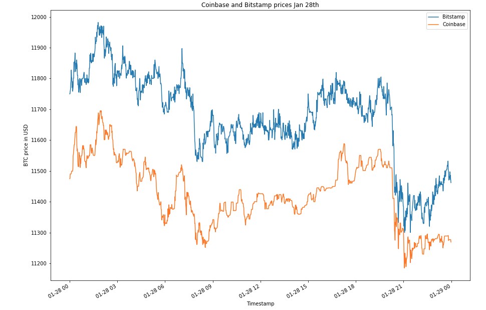

# Bitcoin Arbitrage Analysis
Challenge 3 for fintech bootcamp with UC Berkeley, arbitrage analysis with pandas on Bitcoin prices across two exchanges.

This Python notebook `crypto_arbitrage.ipynb` was created in Jupyter labs and analyzes the Bitcoin price from January 2018 to April 2018 across Bitstamp and Coinbase. The CSV files are located in the Resources folder. The notebook is ready to run analysis on three days. Two out of the three days did not produce profitable trades; therefore, there is an extra day analyzed. It would be easy to follow along and run analysis on other days using the same logic. 

The results from this analysis show that the arbitrage opportunites in this dataset were limited to early periods, namely late January. There were little to no profitable trades in the Febraury and March 2018; however, those opporunities in late January showed some strong profits when trading with 1BTC trades.

For example, one of the days analyzed was Jan. 28th, 2018. 

There are some clear opportunities for some trades to be made. After doing all the math and code, this was the cumulative profits for a day of trades. 

Jan. 28th, 2018 was by the far the most successful day. If you want to learn more or follow along, keep scrolling down for a more detailed analysis of what you'll need. 

First make sure you have cloned the repo to have the files needed.

---

## Technologies

The above screenshot shows the python version needed `python 3.7` and the only package you will need installed which is `pandas`. If you have set up a `dev` environment with anaconda or something similar you will be fine. If not keep scrolling and I will help explain. 
If you need the dev environment setup and don't know what [Anaconda]( https://docs.anaconda.com/anaconda/install/) is then click on [Anaconda]( https://docs.anaconda.com/anaconda/install/) and continue after you get that setup!

---

## Installation Guide

To get your `dev` environment setup, and jupyter labs running follow along:

- Creating a dev environment for python 3.7 called 'dev' - if you do not already have an environment setup 
    - Get setup in your preferred CLI (Gitbash, terminal, etc)
    - `conda create -n dev python=3.7 anaconda`
    - Once you have created the environment, type the following to activate and deactivate.

- Once your  `dev`  env is setup, go ahead and navigate to the same directory as the newly cloned repo, and then type  `juypter lab`  in your console.

- Thats it! Then your in, you should see the same as the screenshot below.

- If you get an import error for pandas, just make sure you have pandas installed in your dev environment with a quick `pip install pandas` command and try again.

---
## Usage

Once you are in jupyter labs, open the `crypto_arbitrage.ipynb` notebook. Make sure to run all the lines so you import the packages and create all the dataframes needed to run the analysis. After that, feel free to create more cells at the bottom and perform your own analysis on different dates or under different conditions!

You will find the other dates that I analyzed, which include Mar. 5th, 2018 and Feb. 16th, 2018. These dates failed to produce any trades that were more profitable than 1%, so I did not complete the analysis on these dates. Instead, at the bottom, I did the same steps for Jan. 29th and produced some very nice profits for that day as well. It's interesting to notice on the 29th that after 12:00pm the profits went away and the price difference must have shrunk between the two exchanges. There could be more dates in January that could still provide some opportunities for arbitrage and would be fun to explore further. 

---

## Contributors

[Robin Thorsen](https://www.linkedin.com/in/robin-thorsen-079819120/) was the main developer working on this project. Alot of code was provided by UC Berkeley for this challenge. 

Best reached via email - robinbthorsen@gmail.com

---

## License

Apache 2.0 public License applied, feel free to clone and fork and use and reach out if you have questions. 
